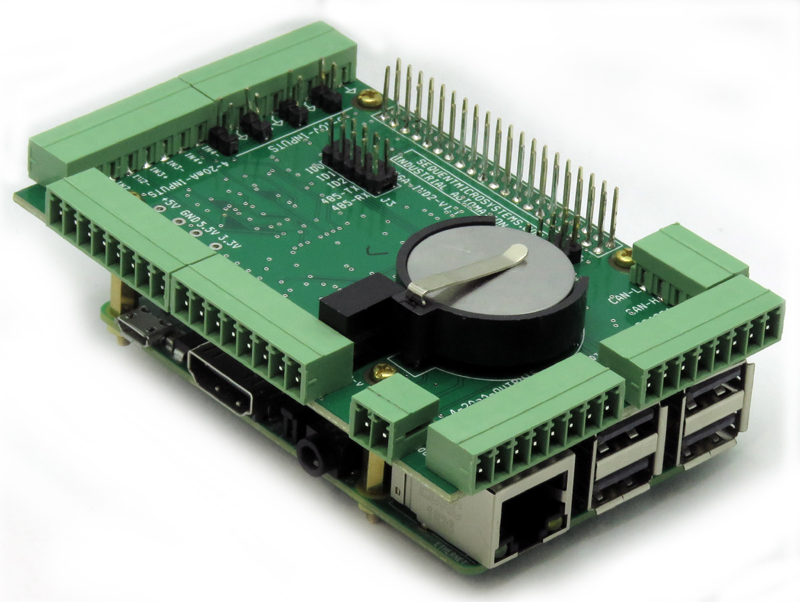

[](https://www.sequentmicrosystems.com)

# megaind-rpi

This is the command to control [Industrial Automation Stackable Card for Raspberry Pi](https://sequentmicrosystems.com/collections/industrial-automation/products/raspberry-pi-industrial-automation).



## Setup

Enable I2C communication first:
```bash
~$ sudo raspi-config
```
A good article about I2C on Raspberry can be found [here.](https://www.raspberrypi-spy.co.uk/2014/11/enabling-the-i2c-interface-on-the-raspberry-pi/) 

If you use Ubuntu you need to install ```raspi-config``` first:

```bash
~$ sudo apt update
~$ sudo apt install raspi-config
```
## Usage

Make sure you have all tools you need:
```bash
~$ sudo apt update
~$ sudo apt-get install git
~$ sudo apt-get install build-essential
```
Install the command:
```bash
~$ git clone https://github.com/SequentMicrosystems/megaind-rpi.git
~$ cd megaind-rpi/
~/megaind-rpi$ sudo make install
```

Now you can access all the functions of the [Industrial Automation Stackable Card for Raspberry Pi](https://sequentmicrosystems.com/collections/industrial-automation/products/raspberry-pi-industrial-automation) through the command "megaind". Use -h option for help:
```bash
~$ megaind -h
```

If you clone the repository any update can be made with the following commands:

```bash
~$ cd megaind-rpi/  
~/megaind-rpi$ git pull
~/megaind-rpi$ sudo make install
```  
[Python Library](https://github.com/SequentMicrosystems/megaind-rpi/tree/master/python)

[NodeRed nodes](https://github.com/SequentMicrosystems/megaind-rpi/tree/master/node-red-contrib-sm-ind)

[firmware update instructions](https://github.com/SequentMicrosystems/megaind-rpi/tree/master/update).

The board can act as Modbus RTU slave device, checkout [modbus instructions](https://github.com/SequentMicrosystems/megaind-rpi/blob/master/MODBUS.md).
