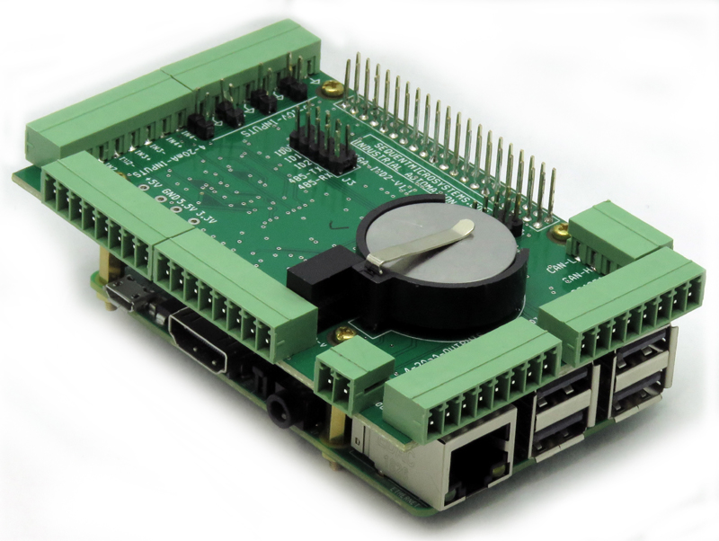
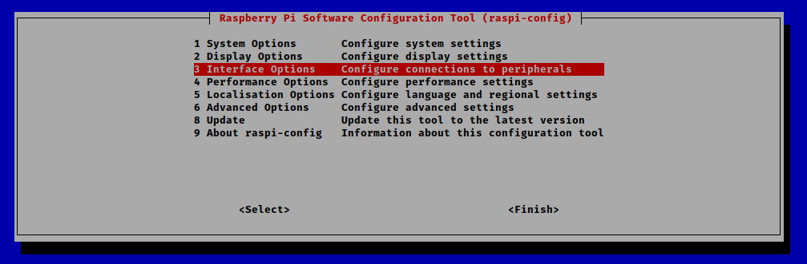
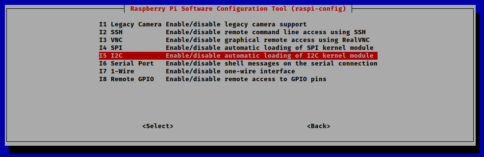
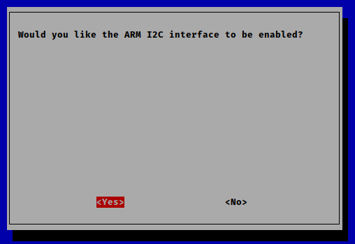

[](https://www.sequentmicrosystems.com)

# megaind-rpi

Official Command Line Interface to control [Industrial Automation Stackable Card for Raspberry Pi](https://sequentmicrosystems.com/products/industrial-automation-for-raspberry-pi).



If you would rather not use the command line, check out:

- [Python Library](https://github.com/SequentMicrosystems/megaind-rpi/tree/master/python)
- [NodeRed nodes](https://github.com/SequentMicrosystems/megaind-rpi/tree/master/node-red-contrib-sm-ind)
- [CODESYS](https://github.com/SequentMicrosystems/SM_CODESYS)
- [OpenPLC]()
- [Home Assistant](https://github.com/sequentmicrosystems/smmultiio-ha)
- [Modbus RTU slave instructions](https://github.com/SequentMicrosystems/megaind-rpi/blob/master/MODBUS.md).
- [firmware update instructions](https://github.com/SequentMicrosystems/megaind-rpi/tree/master/update/README.md)

## Prerequisites

<details>
    <summary>Enable I2C communication</summary>

    This needs to be done once per Raspberry Pi.

    If you use Ubuntu you need to install ```raspi-config``` first:

    ```bash
    sudo apt update
    sudo apt install raspi-config
    ```

    ```bash
    sudo raspi-config
    ```

    Use image from res/i2c/i2c_step1.png

    
    
    
</details>
Install the necessary tools:

```bash
sudo apt update
sudo apt install git build-essential
```
    

## Installation

Install the cli with:
```bash
cd
git clone https://github.com/SequentMicrosystems/megaind-rpi.git
cd megaind-rpi/
sudo make install
```

To update to the latest version:
```bash
cd ~/megaind-rpi/  
git pull
sudo make install
```  

## Usage

Now you can access all the functions of the [Industrial Automation Stackable Card for Raspberry Pi](https://sequentmicrosystems.com/collections/all-io-cards/products/industrial-raspberry-pi) through the command "megaind". Use -h option for help:
```bash
megaind -h
```

## Examples

[RTC Usage](rtc/README.md)