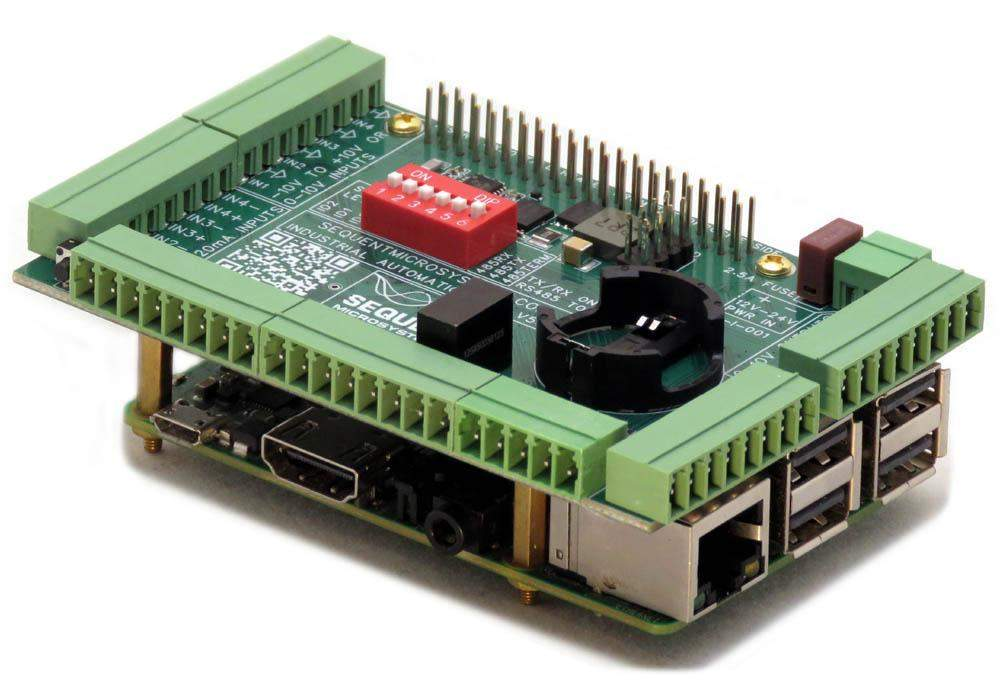

# megaind-rpi

[](https://www.sequentmicrosystems.com)




## Official Repository for the [Industrial Automation Stackable Card for Raspberry Pi](https://sequentmicrosystems.com/products/industrial-automation-for-raspberry-pi) by Sequent Microsystems.

The command line interface (CLI) included in this repository gives you full access to every feature of the card. It is the quickest way to get started and is all you need to operate the card.

If you would rather use a different platform, you can access the same functionality through dedicated, ready-to-use integrations:

- [Python Library](https://github.com/SequentMicrosystems/megaind-rpi/tree/master/python)
- [Node-RED nodes](https://github.com/SequentMicrosystems/megaind-rpi/tree/master/node-red-contrib-sm-ind)
- [CODESYS](https://github.com/SequentMicrosystems/SM_CODESYS)
- [OpenPLC]()
- [Home Assistant Integration](https://github.com/sequentmicrosystems/smmultiio-ha)
- [Modbus RTU slave](https://github.com/SequentMicrosystems/megaind-rpi/blob/master/MODBUS.md)

For a firmware update, please follow the instructions in the link below:

- [Firmware update instructions](https://github.com/SequentMicrosystems/megaind-rpi/tree/master/update/README.md)

## Prerequisites

<details>
<summary>1. Enable I2C communication</summary>

This only needs to be done once on each Raspberry Pi.

On Raspberry Pi OS, install `raspi-config` first:

```bash
sudo apt update
sudo apt install raspi-config
```

Then run:

```bash
sudo raspi-config
```

Follow the steps in the 3 screenshots below to enable I2C communication. After that, reboot the Raspberry Pi for the changes to take effect.


Reboot the Raspberry Pi:

```bash
sudo reboot
```

</details>

<details>
<summary>2. Install git and build-essential packages</summary>

```bash
sudo apt update
sudo apt install git build-essential
```

</details>
    

## Installation

Install the CLI with:

```bash
cd
git clone https://github.com/SequentMicrosystems/megaind-rpi.git
cd megaind-rpi/
sudo make install
```

To update to the latest version:

```bash
cd ~/megaind-rpi/  
git pull
sudo make install
```  

## Usage

Now you can access all the functions of the [Industrial Automation Stackable Card for Raspberry Pi](https://sequentmicrosystems.com/collections/all-io-cards/products/industrial-raspberry-pi) through the command "megaind". Use -h option for help:

```bash
megaind -h
```

For a more detailed help message about a specific function, use the -h option after the function name. For example:

```bash
megaind -h rtcrd
```

Example output:

```txt
megaind -h rtcrd
    rtcrd:      Get the internal RTC  date and time(mm/dd/yy hh:mm:ss)
    Usage:      megaind <id> rtcrd
    Example:    megaind 0 rtcrd; Get the nternal RTC time and date on Board #0
```

## Examples

[RTC Usage](rtc/README.md)
